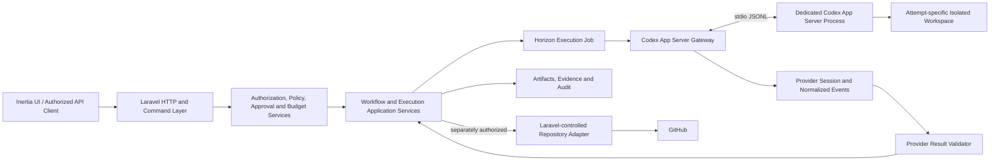
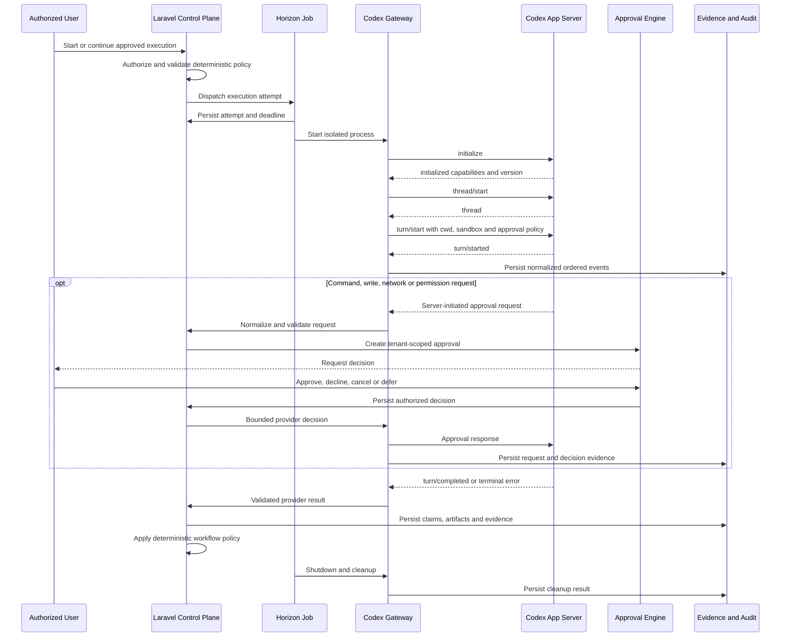

# ADR-0008: Use Codex App Server with Laravel-managed isolated execution

- Status: Accepted
- Date: 2026-08-04
- Ticket: AIOS-241
- Owners: System Architect, Security Reviewer, Product Owner
- Extends: ADR-0005
- Review cadence: Every material Codex transport, sandbox, credential, provider-capability, repository-write, merge, or deployment change

## 1. Context

The AI Operating System MVP uses provider-neutral contracts with deterministic
simulation providers for planning, development, and quality assurance.

Post-MVP work will introduce Codex as a real execution provider without
replacing the existing Laravel workflow engine, execution model, approval
engine, evidence model, retry handling, ticket leases, or audit history.

Codex is a probabilistic execution provider. It is not an authoritative workflow
engine, authorization service, policy service, repository integration, evidence
verifier, or merge authority.

The integration must preserve these existing invariants:

1. Laravel owns durable workflow truth.
2. Laravel owns organization and project authorization.
3. Laravel owns provider selection, retries, approvals, cancellation, and
   recovery.
4. Provider messages, repository content, documents, tickets, and generated
   output are untrusted.
5. A provider result cannot directly transition a ticket or workflow.
6. Simulation remains an available provider and fallback.
7. Normal automated pull requests target `develop`.
8. Codex never targets or merges into `main`.
9. Layer 3 review remains independent from Layer 2 implementation.
10. Repository writes, GitHub side effects, merges, and deployments require
    separately authorized Laravel-controlled adapters.

This ADR defines the integration and isolation boundary. It does not implement
the Codex provider.

## 2. Decision summary

The system will integrate Codex through a Laravel-owned provider adapter using
Codex App Server over stdio as the primary interactive transport.

Each execution attempt initially receives one dedicated Codex process, one
attempt-specific credential/configuration directory, and one isolated workspace.

Laravel Horizon jobs or a dedicated Laravel-managed runner own process startup,
initialization, event ingestion, approval responses, interruption, termination,
cleanup, and recovery. Codex processes never run inside an HTTP request
lifecycle.

`codex exec` is reserved for bounded batch, diagnostic, and recovery scenarios
that do not require an interactive approval exchange.

Codex output is normalized, schema-validated, size-bounded, redacted, and mapped
to existing provider result contracts before application services may interpret
it.

## 3. Control-plane boundary

### 3.1 Laravel responsibilities

Laravel remains authoritative for:

- Authentication
- Organization membership
- Project authorization
- Workflow definitions and transitions
- Ticket selection and execution leases
- Provider capability and fallback resolution
- Reasoning-level resolution
- Project and ticket budgets
- Retry limits and backoff
- Timeout and cancellation policy
- Sandbox profile selection
- Network policy
- Approval creation, authorization, expiry, and decision
- Evidence classification
- Artifact persistence
- Repository side effects
- GitHub branch, commit, push, and pull-request operations
- QA eligibility
- Merge advisory
- Human merge decisions
- Notifications
- Audit events
- Recovery and reconciliation

### 3.2 Codex responsibilities

Codex may:

- Analyze approved input
- Propose a plan
- Read files allowed by the sandbox
- Modify files inside an explicitly writable disposable workspace
- Request permission for a bounded command, file write, or network operation
- Execute approved tools inside its sandbox
- Report assumptions, findings, risks, and confidence
- Return structured provider output
- Emit provider lifecycle and usage events

### 3.3 Forbidden Codex responsibilities

Codex must never:

- Authenticate users
- Authorize an action
- Change organization or project scope
- Select its own ticket
- Acquire or release a ticket lease
- Change workflow or ticket state
- Approve its own work
- Grant itself a capability
- Change its sandbox or network policy
- Persist permanent approval rules
- Access another execution workspace
- Receive GitHub write credentials
- Push directly to a protected branch
- Create repository side effects without Laravel authorization
- Merge a pull request
- Target `main`
- Deploy an application
- Mark provider claims as Verified evidence
- Override cancellation
- Suppress audit records

## 4. Architecture



The gateway is infrastructure. It implements provider contracts declared by the
application layer and must not be referenced by domain code.

The workflow engine never consumes raw Codex protocol messages.

## 5. Transport decision

### 5.1 Primary transport

The primary transport is:

```text
codex app-server --listen stdio://
```

The adapter communicates through newline-delimited JSON messages on stdin and
stdout.

stderr is treated as a separate operational log stream and is redacted before
persistence.

### 5.2 Protocol versioning

The implementation must pin an approved Codex version.

During AIOS-244, the implementation must generate and retain the stable protocol
schema for that exact version using the Codex schema-generation command.

The application must:

- Record the Codex binary version
- Record the generated protocol schema version or fingerprint
- Reject incompatible initialization responses
- Reject unknown required message shapes
- Ignore only explicitly documented optional fields
- Avoid experimental API opt-in by default
- Require a separate approved change before enabling experimental methods

Updating Codex or its generated protocol schema is a reviewed dependency change,
not an invisible runtime upgrade.

### 5.3 Batch and recovery transport

`codex exec --json --ephemeral` may be used only for:

- Bounded one-shot read-only tasks
- Diagnostics
- Contract investigation
- Safe recovery where interactive approval is unnecessary
- Explicitly approved live smoke testing

It is not the primary application transport.

The system must not replace an active App Server turn with `codex exec`.
A transport failure ends or retries the current attempt according to Laravel
policy.

### 5.4 Rejected transports

WebSocket App Server transport is rejected for the initial rollout because it
adds an unnecessary listener, port, authentication boundary, and network attack
surface while the interface remains experimental.

A permanent Node.js orchestration service is rejected because the application
already owns orchestration, queues, retries, authorization, audit, and
persistence through Laravel.

Direct CLI execution from an HTTP controller is rejected because process
lifetimes, approvals, timeouts, and cleanup must not depend on a web request.

## 6. Process ownership

### 6.1 Initial ownership model

One Laravel-managed execution job owns one Codex process for one execution
attempt.

The owning job is responsible for:

1. Loading the immutable execution context.
2. Revalidating project and ticket lineage.
3. Resolving provider, sandbox, network, reasoning, retry, and budget policy.
4. Allocating the isolated runtime directories.
5. Materializing short-lived provider configuration.
6. Starting the Codex process.
7. Completing the initialization handshake.
8. Starting or resuming the approved thread and turn.
9. Reading and validating the stdout stream.
10. Handling server-initiated approval requests.
11. Updating the durable heartbeat.
12. Mapping terminal provider output.
13. Interrupting or terminating the process.
14. Persisting cleanup evidence.
15. Returning control to existing application orchestration.

### 6.2 Process isolation

The Codex child process must:

- Run as a non-root operating-system identity
- Have no Docker socket
- Have no host home-directory mount
- Have no cloud-instance metadata access
- Have no production environment file
- Have no shared writable workspace
- Have no database credential
- Have no Redis credential
- Have no Laravel application key
- Have no GitHub write credential
- Have bounded CPU, memory, process, file, output, and execution time
- Receive only explicitly assembled provider context
- Receive only the credentials required for the current provider invocation

### 6.3 Attempt-specific runtime directories

Each attempt receives directories equivalent to:

```text
runtime/codex/{organization}/{project}/{execution}/{attempt}/
    codex-home/
    workspace/
    tmp/
    artifacts/
```

The actual production root may differ, but its ownership and lineage must remain
equivalent.

Directories must use restrictive permissions and must not be reused by another
attempt.

### 6.4 Long-running processes

The initial architecture does not use a shared or permanent Codex daemon.

A future dedicated Laravel-managed runner may replace direct Horizon process
ownership only when:

- Execution duration requires it
- Process supervision is independently secured
- Tenant isolation remains equivalent
- Durable session ownership is defined
- Deployment and recovery behavior is proven
- A new ADR or approved amendment authorizes the topology change

## 7. Execution lineage

Every Codex process, request, event, approval, artifact, and result must be
correlated to:

- Organization ID
- Project ID
- Workflow instance ID, when applicable
- Ticket stable ID
- Ticket lease ID
- Project context snapshot ID
- Project context fingerprint
- Execution ID
- Attempt ID
- Attempt number
- Provider identifier
- Codex version
- Model identifier
- Requested reasoning level
- Effective reasoning level
- Sandbox profile
- Network policy
- Provider policy version
- Approval policy version
- Correlation ID
- Causation ID

Provider-generated thread, turn, and item IDs are additional external
identifiers. They do not replace internal lineage.

## 8. Protocol lifecycle



## 9. Event ingestion

### 9.1 Raw provider messages

Raw messages are untrusted.

Before a message may affect application behavior, the gateway must:

1. Enforce a maximum encoded message size.
2. Parse JSON without object instantiation.
3. Validate message framing.
4. Validate request, response, notification, and error shapes.
5. Validate known IDs and method names.
6. Validate required scalar and collection types.
7. Reject malformed or conflicting messages.
8. Redact sensitive values.
9. Assign an internal monotonic attempt sequence.
10. Persist only the approved normalized representation.

### 9.2 Ordering

Provider events are ordered using an internal monotonic sequence allocated by
the gateway for the current attempt.

Provider thread, turn, and item identifiers are preserved as external
correlation fields.

Duplicate normalized events are rejected or idempotently ignored using:

```text
attempt ID
+ internal sequence
+ provider method
+ provider event identifier
+ canonical payload fingerprint
```

Out-of-order terminal events cannot advance workflow state.

### 9.3 Initial bounds

Initial implementation defaults are:

| Limit | Initial maximum |
|---|---:|
| Initialization handshake | 30 seconds |
| One encoded provider message | 1 MiB |
| One normalized persisted event | 256 KiB |
| Redacted transcript per attempt | 25 MiB |
| Persisted events per attempt | 100,000 |
| Cancellation grace period | 10 seconds |
| Heartbeat persistence interval | 15 seconds |
| Stale heartbeat threshold | 45 seconds |

These values are configurable within system-enforced maximums.

AIOS-244, AIOS-245, AIOS-247, and AIOS-288 may reduce them based on measured
behavior. Raising a security-sensitive maximum requires review.

### 9.4 Transcript policy

The unredacted raw protocol stream must not be durably persisted.

The system persists:

- Normalized redacted events
- Canonical payload fingerprints
- Provider thread, turn, and item identifiers
- Bounded redacted transcript artifacts
- Terminal result
- Usage and timing metadata
- Rejection and truncation records

Transcript truncation is explicit evidence. It must not be silently omitted.

## 10. Provider result boundary

The Codex adapter maps provider output into the existing planning, development,
or QA result contract.

The adapter may not return an unvalidated arbitrary provider payload to the
workflow engine.

The sequence is:

```text
Provider protocol
 -> protocol validation
 -> normalization
 -> redaction
 -> bounded transcript and event persistence
 -> provider-specific result mapping
 -> existing application result validator
 -> deterministic application policy
 -> workflow transition or rejection
```

A provider-reported success does not prove:

- Tests passed
- CI passed
- Security passed
- Repository state changed
- A pull request exists
- A merge occurred
- A deployment occurred

Those claims remain Reported evidence until independently observed or verified.

## 11. Sandbox profiles

### 11.1 Planning read-only

The planning profile provides:

- Read-only approved project context
- Read-only repository snapshot when explicitly enabled
- Writable attempt temporary directory
- No repository modification
- No GitHub credentials
- Network denied by default
- No persistent shared memory
- No production secrets

Planning cannot publish tickets or approve a roadmap directly.

### 11.2 Development workspace-write

The development profile provides:

- One disposable workspace
- One verified immutable base reference
- Write access only inside the workspace
- Explicit command policy
- Network denied by default
- No access to host repository paths
- No GitHub write credential
- No protected-branch access
- No direct branch, push, pull-request, merge, or deployment authority

Codex may modify files in the workspace. Laravel-controlled infrastructure
independently validates and performs separately approved repository side
effects.

### 11.3 QA read-only

The QA profile provides:

- A new process
- A new thread
- A separate execution and attempt
- Read-only exact base and head evidence
- Read-only diff and artifact manifests
- No access to Layer 2 conversational state
- No repository write access
- No GitHub write credential
- Network denied by default

The Layer 2 process cannot be reused as the sole Layer 3 reviewer.

## 12. Filesystem policy

The execution boundary must prevent:

- Absolute path escape
- `..` traversal outside the workspace
- Symlink escape
- Hard-link escape
- Mount escape
- Writes through `/proc`, `/sys`, device paths, or sockets
- Access to Docker or container-management sockets
- Writes to the immutable base checkout
- Access to another attempt directory

Workspace cleanup must not follow untrusted symlinks.

## 13. Command policy

A requested command is classified by Laravel-owned policy as:

- Allowed
- Denied
- Human approval required
- Unsupported

The provider cannot classify its own command as allowed.

Policy evaluates at least:

- Executable
- Arguments
- Working directory
- Environment additions
- Input/output redirection
- Shell metacharacters
- Expected duration
- Resource requirements
- Filesystem impact
- Network impact
- Ticket scope
- Sandbox profile
- Project policy
- Existing approval context

Deterministic validation commands remain independently executed by
Laravel-controlled infrastructure. Provider command claims do not replace
observed validation evidence.

## 14. Network policy

Network access is denied by default at both:

1. Provider sandbox configuration
2. Operating-system or container execution boundary

Provider configuration alone is not considered sufficient isolation.

An approved network exception must specify:

- Organization
- Project
- Execution
- Attempt
- Requested destination
- Port and protocol
- Purpose
- Scope
- Expiry
- Approval actor
- Approval decision
- Policy version

Broad internet access, wildcard destinations, private-network access, cloud
metadata access, and local control-plane access remain denied.

A Codex request for network access is only a request. It cannot amend policy by
itself.

## 15. Approval bridge

Codex server-initiated approval requests are translated into existing
tenant-scoped Laravel approvals.

The bridge must:

1. Validate the provider request.
2. Bind it to the current attempt, thread, turn, and item.
3. Calculate a canonical request fingerprint.
4. Evaluate deterministic policy.
5. Deny unsupported requests immediately.
6. Create an application approval when human input is required.
7. Persist immutable request context.
8. Apply authorization and expiry.
9. Accept one idempotent decision.
10. Return the narrowest supported provider decision.
11. Persist the provider response and outcome.
12. Reject replay against another attempt or request.

Provider options such as session-wide or persistent approval do not
automatically become Laravel policy.

A session-scoped approval may be returned only when an existing project policy
and authorized human decision explicitly permit the same narrowly defined
operation for the current attempt.

Persistent provider-side approval is disabled.

Approval timeout fails closed through decline or cancellation.

## 16. Credential ownership

### 16.1 Authoritative storage

Codex credentials are stored through the existing encrypted provider credential
boundary.

The browser receives only safe metadata such as:

- Provider configured state
- Credential status
- Last rotation timestamp
- Last validated timestamp
- Safe credential identifier

The browser never receives the credential secret.

### 16.2 Runtime materialization

At attempt startup, Laravel materializes only the required provider
authentication into the attempt-specific runtime boundary.

Runtime credential material must:

- Exist only for the attempt
- Use restrictive filesystem permissions
- Avoid command-line arguments
- Avoid process listings
- Avoid logs
- Avoid provider prompts
- Avoid artifacts
- Avoid notifications
- Be removed during cleanup

Production execution must not depend on a developer's shared interactive Codex
login state.

### 16.3 Provider home directory

Each attempt receives an isolated `CODEX_HOME`.

A shared user-level Codex home is forbidden in production because it can leak:

- Authentication state
- Configuration
- Session history
- Approval state
- Cached provider data
- Cross-project provenance

## 17. Cancellation and termination

Cancellation is idempotent and Laravel-owned.

The sequence is:

```text
Persist cancellation request
 -> prevent new approval grants and repository side effects
 -> request turn interruption
 -> wait bounded grace period
 -> send graceful process termination
 -> wait bounded process grace period
 -> force-kill if still alive
 -> capture terminal and cleanup evidence
 -> resolve attempt through execution resilience policy
 -> release or retain the ticket lease according to deterministic policy
```

Cancellation wins over a racing provider success that has not yet committed an
authorized terminal application transition.

A killed process does not imply a safely cancelled operation. Cleanup and
workspace reconciliation must complete before the attempt is considered
recovered.

## 18. Heartbeats and liveness

The execution owner records:

- Process start timestamp
- Operating-system process identifier or runtime handle
- Codex version
- Initialization timestamp
- Last provider message timestamp
- Last durable heartbeat timestamp
- Current thread and turn identifiers
- Current lifecycle state
- Cancellation state
- Cleanup state

A stale heartbeat causes recovery evaluation. It does not automatically create
a retry.

## 19. Recovery

Recovery handles at least these cases:

### 19.1 Process gone, no terminal event

- Mark the provider session orphaned or lost.
- Preserve the last normalized event.
- Classify actual state as Unverified.
- Inspect workspace and side-effect records.
- Apply bounded retry policy.
- Never assume success.

### 19.2 Process alive, owner gone

Because stdio ownership cannot safely be transferred by assumption:

- Prevent a second provider process from starting.
- Attempt controlled termination.
- Reconcile workspace state.
- Record orphan cleanup evidence.
- Retry only after the original process is confirmed terminated.

### 19.3 Terminal event persisted, application transaction incomplete

- Replay the normalized terminal event idempotently.
- Re-run result mapping and validation.
- Reapply application transition guards.
- Do not call the provider again unless policy requires a new attempt.

### 19.4 Approval pending during failure

- Expire or cancel the application approval.
- Respond to the provider only when the original process remains valid.
- Prevent the decision from being reused by another attempt.
- Preserve the unresolved approval as audit evidence.

### 19.5 Workspace cleanup failure

- Quarantine the workspace.
- Do not reuse it.
- Prevent credentials from remaining mounted or materialized.
- Notify operations.
- Block automatic retry when safe isolation cannot be proven.

### 19.6 External side-effect ambiguity

- Query the authoritative external system using stored idempotency and external
  identifiers.
- Reconcile before retry.
- Never repeat branch, commit, push, pull-request, merge, or deployment effects
  based only on an exception.

## 20. Evidence and audit

Every real provider attempt must preserve:

- Input context snapshot identity
- Canonical request manifest and fingerprint
- Provider and model identity
- Codex version and protocol schema fingerprint
- Sandbox and network policy
- Runtime resource policy
- Provider thread, turn, and item identifiers
- Normalized provider events
- Redacted transcript artifact
- Approval requests and decisions
- Provider claims
- Observed workspace changes
- Independent validation output
- Result validation outcome
- Retry and cancellation decisions
- Cleanup outcome
- Cost and usage
- Correlation and causation IDs

Provider output begins as Reported evidence.

A workspace inspection may become Observed evidence.

Only an authorized verifier using an immutable source may create Verified
evidence.

## 21. Repository side effects

Codex does not receive GitHub write credentials.

After a successful development provider result:

1. Laravel verifies the workspace and immutable base.
2. Laravel runs deterministic validation independently.
3. Laravel records real diff and evidence manifests.
4. Laravel applies repository policy.
5. Laravel obtains required approval.
6. A Laravel-controlled GitHub adapter performs one idempotent side effect.
7. The adapter records external identifiers and immutable SHAs.
8. Reconciliation confirms the external state.

Normal pull requests target `develop`.

Any attempt to target `main` is rejected before an external write.

Codex never merges a pull request.

## 22. Layer independence

Layer 2 and Layer 3 use:

- Different execution IDs
- Different attempt IDs
- Different processes
- Different threads
- Separate provider context
- Separate workspace profiles
- Independent evidence requests

The Layer 3 provider may use Codex, but it must not inherit Layer 2
conversational state or act as the sole approver of its own work.

## 23. Simulation fallback

Simulation remains registered and testable.

Fallback to simulation is permitted only when project policy allows it.

The system must visibly preserve:

```text
execution_provider: simulation
effective_reasoning_level: simulated
actual_state: unverified
```

A fallback execution creates a new attempt and must not rewrite Codex attempt
provenance.

## 24. Rollout plan

### Stage 0 — ADR only

- Record this decision.
- Add threat-model appendix.
- Add documentation contract.
- Do not enable Codex execution.

### Stage 1 — Provider foundation

AIOS-242 through AIOS-248:

- Generalize capabilities
- Configure credentials and policy
- Add App Server gateway
- Persist provider sessions and events
- Bridge approvals
- Add cancellation and recovery
- Add deterministic fake-server tests

No real repository writes are enabled.

### Stage 2 — Read-only Layer 1

AIOS-249 through AIOS-254:

- Build versioned context
- Add real planning provider
- Validate structured output and references
- Add provider selection and fallback
- Project activity into the office
- Complete Layer 1 acceptance testing

Roadmap approval remains human-controlled.

### Stage 3 — Controlled Layer 2

AIOS-255 through AIOS-263:

- Verify GitHub App read access and repository policy
- Allocate isolated workspaces
- Check out immutable repository state
- Enforce sandbox, command, write, and network policy
- Enable workspace-only Codex development
- Run deterministic validation independently
- Capture real evidence
- Create idempotent draft pull requests through Laravel
- Complete recovery and duplicate-side-effect testing

Normal pull requests target `develop`.

### Stage 4 — Independent Layer 3

AIOS-264 through AIOS-269:

- Extend QA request evidence
- Add independent read-only Codex QA
- Observe GitHub and CI evidence
- Run deterministic security and architecture checks
- Produce merge advisory
- Preserve human merge decisions
- Complete Layer 3 acceptance testing

Codex still cannot merge.

### Stage 5 — Office v2

AIOS-270 through AIOS-283 consume normalized provider and workflow events.

Office and 3D clients remain projections. They cannot become workflow authority.

### Stage 6 — Production hardening

AIOS-284 through AIOS-289 add:

- Provider health and budgets
- Full Codex security review
- Operational metrics
- Deterministic CI and isolated live smoke workflows
- Performance baselines
- UAT, runbooks, release review, and rollback

Controlled autonomy requires a later approved decision and is not authorized by
this ADR.

## 25. Follow-up ticket traceability

| Ticket | Responsibility governed by this ADR |
|---|---|
| AIOS-242 | Generalize provider capabilities without moving policy into providers |
| AIOS-243 | Store and rotate credentials without browser or log exposure |
| AIOS-244 | Implement the typed stdio App Server gateway |
| AIOS-245 | Persist session, thread, turn, event, and heartbeat lineage |
| AIOS-246 | Translate provider requests into Laravel approvals |
| AIOS-247 | Implement timeout, cancellation, heartbeat, and recovery |
| AIOS-248 | Provide deterministic fake App Server contract coverage |
| AIOS-249 | Assemble versioned and redacted provider context |
| AIOS-250 | Implement read-only Codex planning behind the existing contract |
| AIOS-251 | Validate structured planning output and source references |
| AIOS-252 | Resolve approved project provider and fallback policy |
| AIOS-253 | Project normalized planning activity into office read models |
| AIOS-254 | Prove real Layer 1 behavior and regressions |
| AIOS-255 | Verify GitHub App repository-read policy before execution |
| AIOS-256 | Create isolated and disposable workspaces |
| AIOS-257 | Check out an immutable verified base reference |
| AIOS-258 | Enforce sandbox, filesystem, command, resource, and network policy |
| AIOS-259 | Implement workspace-only Codex development execution |
| AIOS-260 | Run deterministic validation independently of Codex |
| AIOS-261 | Capture real diff, artifact, and evidence manifests |
| AIOS-262 | Perform idempotent branch, commit, push, and draft PR side effects through Laravel |
| AIOS-263 | Prove recovery and zero duplicate repository side effects |
| AIOS-264 | Extend immutable QA request evidence |
| AIOS-265 | Perform independent read-only Codex QA |
| AIOS-266 | Observe immutable GitHub PR and check-run state |
| AIOS-267 | Run deterministic security, architecture, migration, and policy checks |
| AIOS-268 | Produce advisory and changes-requested behavior without provider merge authority |
| AIOS-269 | Prove Layer 3 independence, evidence, and authorization |
| AIOS-270 | Define UI tokens and information architecture without moving authority to UI |
| AIOS-271 | Build the office shell over authoritative read models |
| AIOS-272 | Display operational and approval state |
| AIOS-273 | Display bounded live operational events |
| AIOS-274 | Consume ordered Reverb projections with reconciliation |
| AIOS-275 | Inspect normalized cross-layer execution lineage |
| AIOS-276 | Prove accessibility, authorization, and visual behavior |
| AIOS-277 | Enforce asset and rendering budgets |
| AIOS-278 | Render rooms from authoritative projection state |
| AIOS-279 | Present agent states without client-owned workflow logic |
| AIOS-280 | Animate deterministic visual handoffs only |
| AIOS-281 | Provide accessible room and scene selection |
| AIOS-282 | Drive ambient effects from durable projection events |
| AIOS-283 | Prove performance and state consistency |
| AIOS-284 | Add provider health, rates, budgets, backpressure, and circuit breakers |
| AIOS-285 | Complete the real-provider security review |
| AIOS-286 | Add provider and workspace operational metrics |
| AIOS-287 | Keep PR CI deterministic and isolate live provider smoke tests |
| AIOS-288 | Establish measured execution and UI performance baselines |
| AIOS-289 | Complete UAT, runbooks, documentation, sign-off, and release review |

## 26. Rejected alternatives

### 26.1 Codex as workflow orchestrator

Rejected because provider output is probabilistic and cannot own durable
authorization, state transitions, retries, approval, or audit truth.

### 26.2 Direct Codex invocation from controllers

Rejected because HTTP request lifetime is unsuitable for long-running,
interruptible, approval-driven execution.

### 26.3 Shared app-server process across tenants

Rejected because it creates session, credential, transcript, approval, and
workspace isolation risk.

### 26.4 Permanent Node.js orchestration service

Rejected because the existing Laravel application already owns application
orchestration and no independent service boundary is justified.

### 26.5 App Server WebSocket transport for initial rollout

Rejected because stdio provides a smaller local attack surface and the
WebSocket interface is not required.

### 26.6 Unrestricted sandbox or network

Rejected because provider configuration is not an authorization boundary and
real repository execution is a critical-risk capability.

### 26.7 GitHub credentials inside the Codex sandbox

Rejected because repository side effects must remain separately authorized,
idempotent, reconcilable Laravel operations.

### 26.8 Provider-controlled persistent approvals

Rejected because approval scope and lifetime must remain application policy.

### 26.9 Automatic transport switching during an attempt

Rejected because it would break provider session lineage, event ordering,
approval context, and deterministic recovery.

### 26.10 Reusing the Layer 2 session for Layer 3

Rejected because implementation and QA must be independent.

## 27. Consequences

### Positive

- Preserves the existing modular-monolith architecture.
- Reuses existing provider contracts and validators.
- Keeps Laravel authoritative.
- Provides clear process and tenant isolation.
- Supports interactive approvals.
- Keeps external repository effects idempotent.
- Supports simulation fallback.
- Enables staged productionization.
- Avoids a new orchestration service.
- Maintains independent QA.

### Negative

- One process per attempt consumes more resources than pooling.
- Interactive stdio requires robust process supervision.
- Provider protocol schemas must be versioned and reviewed.
- Approval-driven jobs can be long-running.
- Orphan cleanup requires explicit operational handling.
- Read-only and write-enabled sandbox policies require separate validation.
- Real provider integration adds a new critical trust boundary.

### Neutral

- This ADR does not enable Codex.
- This ADR does not add credentials.
- This ADR does not authorize repository writes.
- This ADR does not authorize merges.
- This ADR does not authorize deployments.

## 28. Security entry gates

Codex execution remains disabled until all applicable gates pass:

- AIOS-241 approved
- Provider capabilities remain provider-neutral
- Credentials remain encrypted and browser-inaccessible
- App Server gateway contract tests pass
- Fake-server approval and recovery tests pass
- Sandbox and network policy pass security review
- Cancellation and orphan cleanup pass
- Provider output validation fails closed
- Simulation fallback remains available
- No Critical or High security finding remains open for the enabled stage

Layer 2 additionally requires:

- GitHub App least-privilege verification
- Isolated workspace proof
- Immutable base verification
- Independent validation runner
- Zero duplicate repository side effects
- Pull requests targeting `develop` only

Layer 3 additionally requires:

- Separate process and thread
- Immutable GitHub and CI evidence
- Deterministic blocking checks
- Human merge decision

## 29. Rollback

Before implementation tickets depend on this ADR, rollback is a normal
documentation revert.

After AIOS-242 or later implementation depends on this decision:

- Do not silently edit the ADR.
- Create a superseding ADR.
- Identify affected provider contracts, migrations, configuration, security
  controls, tests, runbooks, and active executions.
- Disable Codex provider selection.
- Preserve simulation fallback.
- Reconcile or cancel active Codex attempts.
- Preserve historical evidence and audit lineage.

## 30. Review triggers

Review or supersede this ADR when:

- Codex transport changes
- Experimental App Server APIs are enabled
- A shared provider process is proposed
- Provider process ownership leaves Horizon or Laravel management
- Sandbox technology changes
- Network access broadens
- New credential types are introduced
- Repository writes are enabled
- GitHub scopes change
- Layer 3 independence changes
- Automated merge is proposed
- Deployment capability is proposed
- A Critical or High provider incident occurs
- Provider protocol incompatibility is discovered
- The threat model or evidence model changes materially

## 31. References

- AI Operating System Final Product and Technical Specification v1.2
- Canonical Notion AI Operating System — Delivery Tracker
- AIOS-241
- ADR-0005
- Codex App Server protocol documentation
- Laravel 13 queue documentation
- Laravel Horizon documentation
- Codex execution threat-model appendix
- AIOS-241 architecture review evidence
